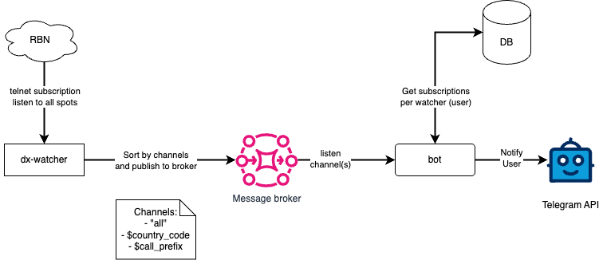

# RBN Spoter in microservices

Lets use Redis pub/sub as message brocker to connect RBN with subscribers.

RBN consumer, who sent all spots to Redis written on golang.

Telegram bot will be on node in sake of simplicilty.



## Start 

### Broker
```shell
docker compose up
```

### Emiter
```shell
source venv/bin/activate
python emit_log_direct.py
```

### Receiver
```shell
source venv/bin/activate
python receive_logs_direct.py
```

## Setup ENV
```shell
python -m venv 
```

